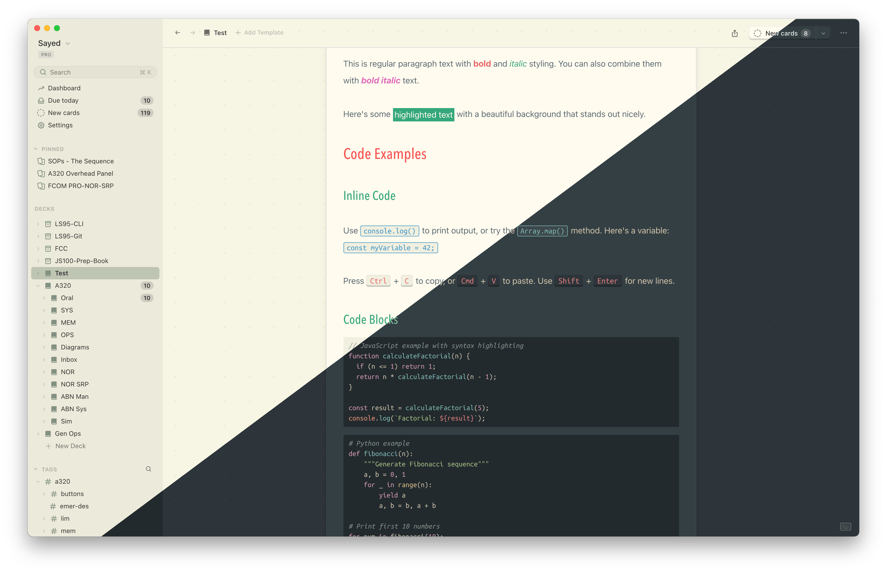

# Everforest Theme for the Mochi.cards App

A beautiful, customizable Everforest color scheme for the Mochi flashcard application. This theme provides carefully crafted dark and light modes with excellent readability and visual comfort. Some inspirations from the incredible Obsidian Primary theme.



## Features

### Core Features
- **Dual Mode Support**: Seamless dark and light theme variants in one file.
- **Contrast Options**: Three contrast levels (hard, medium, soft) for both dark and light modes (default medium dark, hard light).
- **Rainbow Headings**: Optional colorful heading styles (H1-H6).
- **Custom list styles**: Optional custome numbered bullets and indent lines.
- **Syntax Highlighting**: Custom code block styling with language-specific syntax colors
- **Enhanced Typography**: Custom font family and styles for standard and extended markdown syntax.

### UI Enhancements
- Styled inline code blocks with blue accents and borders
- Custom keyboard input (`<kbd>`) styling with 3D effect
- Highlighted text (markdown `==text==`) with yellow background
- Enhanced table styling with alternating row colors
- Smooth scrolling for footnote navigation
- Improved tag display with monospace fonts

## Installation

1. Copy the compiled CSS file to your Mochi custom CSS location:
   - Navigate to Mochi's settings
   - Find the Custom CSS theme option
   - Import `everforest-primary.css`

> Note: You need to redo the above steps every time you update the theme file!

2. Alternatively, if you want to customize the theme, use the SCSS source files (see Customization section below)


## How to Use

Once installed, the theme automatically adapts to your Mochi dark/light mode setting:

- **Dark Mode**: Activates when Mochi is set to dark theme
- **Light Mode**: Activates when Mochi is set to light theme

No additional configuration is needed for basic usage.

## Customization

### Using SCSS (Recommended for Customization)

The theme is built with SCSS and offers extensive customization options:

1. **Prerequisites**: [Install SASS](https://sass-lang.com/install)
2. **Edit Settings**: Open `_settings.scss` and modify as desired:
3. **Compile**: Generate the CSS file

```bash
sass --watch everforest-primary.scss everforest-primary.css
```

### Customization Options

#### Contrast Levels
- **Hard**: Maximum contrast between background and foreground (default for light mode)
- **Medium**: Balanced contrast (default for dark mode)
- **Soft**: Lower contrast for reduced eye strain

#### Rainbow Headings
Enable or disable colorful heading styles by setting `rainbow-headings` to `true` or `false`. When enabled, you can customize which color is applied to each heading level (H1-H6) using the `rainbow-colors` list.

Available colors: `red`, `orange`, `yellow`, `green`, `aqua`, `blue`, `purple`

> Note: The default for H1 heading is foreground color.


### File Structure

```
├── _base.scss                    # Main theme logic and Mochi-specific styles
├── _colors.scss                  # Everforest color palette definitions
├── _syntax-highlighting.scss     # Code syntax highlighting styles
├── _settings.scss                # Custom settings options
├── everforest-primary.scss       # Main entry point
└── everforest-primary.css        # Compiled output (ready to use)
```

## References

- [Original Everforest by sainnhe](https://github.com/sainnhe/everforest)
- [Obsidian Primary Theme](https://primary-theme.github.io/)
- [Mochi Website](https://mochi.cards)
- [Sass Docs](https://sass-lang.com)

## Contributing

Feel free to customize this theme to your preferences! If you create improvements or variants, consider sharing them with the [Mochi community](https://forum.mochi.cards/).

## License

This theme is based on the Everforest color scheme and the Obsidian Primary theme. Please refer to the original repositories for licensing information.
